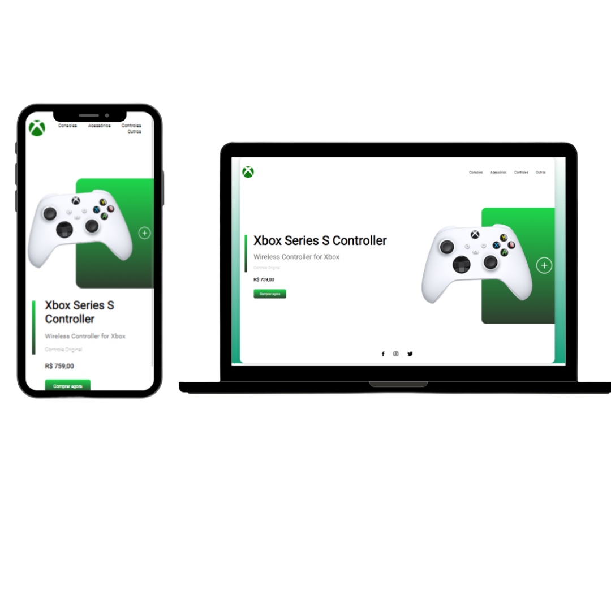

# ㅤXbox Store Controller

#### Uma segunda versão de uma Landing Page já criada aqui no meu perfil, desta vez trazendo a store da Xbox e não do PlayStation

## 💻 Technologies

 ###   [HTML5](https://pt.wikipedia.org/wiki/HTML5) - Uma linguagem de marcação.
###   [CSS3](https://pt.wikipedia.org/wiki/CSS3#:~:text=CSS3%20é%20a%20terceira%20mais,web%20(página%20de%20internet).) -  Cascading Style Sheets (ou simplesmente CSS), pela qual se define estilos para um projeto web.
---

---
Made with ❤️ por Juão Pinheiro 😊
